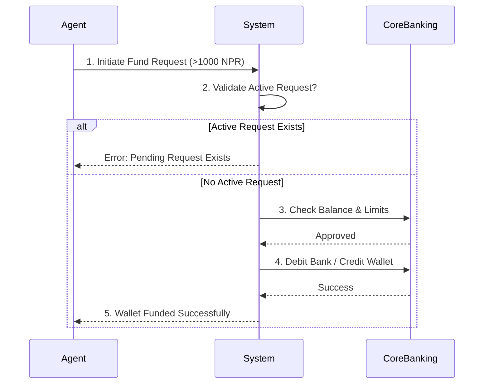

# Self-Funding Module

[](https://github.com/topics/business-analyst)
[](https://github.com/topics/fintech)
[](https://github.com/topics/status)

## 📌 Executive Summary

The **Self-Funding Module** is a critical financial utility designed to allow field agents to autonomously fund their transaction wallets. By automating the request-validation-credit loop, this module eliminates manual intervention from the finance team, reducing funding turnaround time from hours to seconds while maintaining strict audit trails.

**Key Features:**
*   **Automated Validation**: Checks agent eligibility, request limits, and active constraints.
*   **Security**: Prevents duplicate requests (only one active request allowed per agent).
*   **Thresholds**: Enforces a minimum funding amount (e.g., 1000 NPR) to optimize transaction costs.

---

## 📂 Repository Structure

```
.
├── assets/                 # Flowcharts and visual aids
├── documentation/          # Detailed Business Rules and APIs
│   ├── Business_Rules.md
│   └── API_Specs.md
├── src/                    # Source code (if applicable)
└── README.md
```

---

## 🔄 Process Flow

The following diagram illustrates the self-funding lifecycle, replacing legacy manual workflows:



---

## 💡 Business Rules

1.  **Minimum Amount**: Requests must be >= **1000 NPR**.
2.  **Concurrency**: An agent can have only **one** pending request at a time.
3.  **Audit**: All requests (Success/Fail) are logged with a timestamp and IP address.

---

## 🚀 Getting Started

Review the full [Business Rules](./documentation/Business_Rules.md) for detailed logic.
