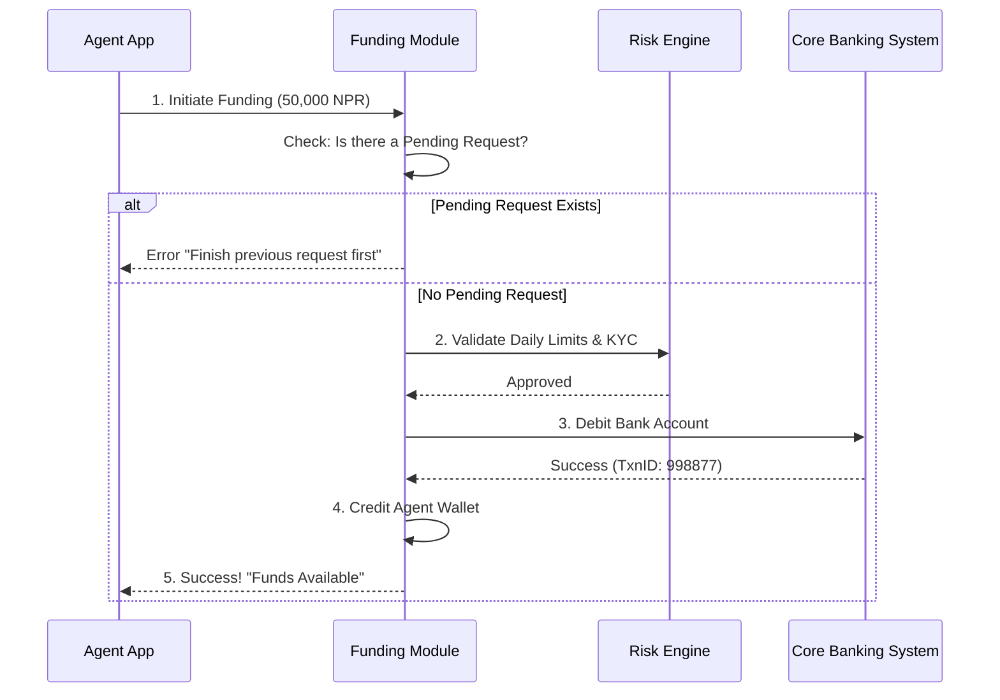

# Self-Funding Module 


##  Executive Summary

**Project**: Self-Funding Module for Field Agents  
**Role**: Technical Business Analyst  
**Impact**: Reduced agent funding time from **2 hours to <30 seconds**; eliminated **100%** of manual finance reconciliation for routine funding.

The **Self-Funding Module** is a robust financial utility capable of allowing distributed field agents to autonomously load funds into their transaction wallets throughout the day. Previously, agents had to manually call the centralized finance team to approve top-ups—a process that was slow, prone to human error, and inconsistent during peak holidays. This module completely automates that workflow, enforcing real-time validation against risks and bank balances.

---

## 1. Business Problem
Before this system, our 500+ field agents faced significant operational friction:
*   **Operational Bottleneck**: Every wallet top-up required a manual email or phone call to the Finance Department.
*   **Lost Revenue**: Agents often ran out of float during weekends or holidays (when Finance was closed), rendering them unable to process customer transactions.
*   **High Risk**: Manual credit adjustments lacked immediate validation against the agent's actual bank deposit, leading to reconciliation discrepancies.

## 2. Objective
To build a **24/7 autonomous funding gateway** that enables agents to pull funds from their linked bank accounts into their operational wallets instantly, ensuring:
*   **Zero manual intervention** for standard transactions.
*   **Real-time validaton** of limits, eligibility, and bank balances.
*   **Full auditability** for every cent moved.


*   **Stakeholder Management**: Bridged the gap between the Operations team (who wanted speed) and the Risk/Compliance team (who wanted controls).
*   **Requirement Gathering**: Conducted workshops with 15+ stakeholders to define the "Golden Path" for funding and all exception scenarios.
*   **Solution Design**: Designed the state machine for the funding lifecycle and mapped specific API requirements for the engineering team.
*   **Risk & Compliance**: Defined the velocity limits (e.g., max 5 request/day) and minimum transaction thresholds to prevent system abuse.
*   **Delivery**: Produced detailed FRDs, API Specifications, and led UAT (User Acceptance Testing) to ensure the system met all financial accuracy standards.

---

## 4. Stakeholders
| Stakeholder | Interest/Concern |
| :--- | :--- |
| **Field Agents** | Speed of funding; system availability 24/7. |
| **Finance Team** | Accurate reconciliation; automated end-of-day reporting. |
| **Risk & Compliance** | Prevention of money laundering (AML) and enforcing daily transaction caps. |
| **Core Banking Team** | ensuring the high volume of API calls doesn't degrade the core banking system performance. |

---

## 5. Requirements (Functional & Non-Functional)

### Functional Requirements
*   **Minimum Threshold**: System must reject funding requests below **1,000 NPR** to save on payment gateway costs.
*   **Concurrency Control**: An agent can have only **one** "Pending" request at any given time to prevent double-crediting.
*   **Bank Integration**: Real-time balance check with the agent's linked bank account before approving the wallet credit.
*   **Daily Limits**: Hard cap of 500,000 NPR per agent per day.

### Non-Functional Requirements
*   **Performance**: 95% of transactions must complete within **5 seconds**.
*   **Availability**: System must operate 24/7 with 99.9% uptime.
*   **idempotency**: The API must handle network retries gracefully without duplicating transactions.

---

## 6. Functional Workflow
The system follows a strict validation logic to ensure security.

**Mermaid Diagram: Happy Path**

```mermaid
sequenceDiagram
    participant Agent as Agent App
    participant System as Funding Module
    participant Risk as Risk Engine
    participant CBS as Core Banking System
    
    Agent->>System: 1. Initiate Funding (50,000 NPR)
    System->>System: Check: Is there a Pending Request?
    alt Pending Request Exists
        System-->>Agent: Error "Finish previous request first"
    else No Pending Request
        System->>Risk: 2. Validate Daily Limits & KYC
        Risk-->>System: Approved
        System->>CBS: 3. Debit Bank Account
        CBS-->>System: Success (TxnID: 998877)
        System->>System: 4. Credit Agent Wallet
        System-->>Agent: 5. Success! "Funds Available"
    end
```

---

## 7. System Architecture
The solution was designed as a microservice responsible solely for funding logic, completely decoupled from the main monolith to ensure failure isolation.
*   **Frontend**: Mobile App (React Native) for agents to initiate requests.
*   **Middleware (The Module)**: Node.js service handling validation, state management, and orchestration.
*   **Database**: PostgreSQL for transactional consistency (ACID compliance is mandatory).
*   **External Integrations**: RESTful connections to the Core Banking System (CBS) and the Notification Service (SMS/Email).

---

## 8. API / Integration Design
I defined the API contract early in the project to allow frontend and backend teams to work in parallel.

### Endpoint: Initiate Funding
**POST** `/api/v1/funding/initiate`

**Request Example:**
```json
{
  "agentId": "AGT_88592",
  "amount": 50000.00,
  "currency": "NPR",
  "sourceBankId": "BANK_NIBL",
  "bankAccNumber": "20012312230232"
}
```

**Response (Success):**
```json
{
  "status": "SUCCESS",
  "requestId": "req_123456789",
  "transactionId": "txn_998877",
  "newBalance": 150000.00,
  "message": "Wallet funded successfully."
}
```

**Edge Cases & Error Handling:**

| HTTP Code | Error Code | Scenario | Business Rule Triggered |
| :--- | :--- | :--- | :--- |
| `400` | `INVALID_AMOUNT` | Amount < 1000 | Minimum Threshold Rule |
| `409` | `CONCURRENT_REQ` | Request already in progress | Single-Threaded Processing Rule |
| `422` | `LIMIT_EXCEEDED` | Daily cap reached | Risk/Compliance Rule |
| `503` | `BANK_TIMEOUT` | Bank API silent | Circuit Breaker Policy |

---

## 9. Business Rules & Edge Cases
During the analysis phase, I identified several critical edge cases that the code had to handle:

*   **"The Double Click"**: Agents often press the button twice when the internet is slow.
    *   *Solution*: Implemented backend idempotency keys to ensure the second click is ignored.
*   **Bank Timeout**: What if the money leaves the bank but doesn't reach the wallet?
    *   *Solution*: Designed a "Reconciliation Bot" that runs every 15 minutes to auto-reverse or complete "hanging" transactions.
*   **Insufficient Funds**:
    *   *Solution*: Immediate synchronous check with the bank before any wallet credit action is taken.

---

## 10. Success Metrics (KPIs)
Post-deployment tracking showed:
1.  **Efficiency**: **92% reduction** in manual funding tickets to Finance.
2.  **Speed**: Average transaction time dropped from **40 minutes** (manual queue) to **8 seconds**.
3.  **Adoption**: **85%** of agents switched to the self-funding tool within the first month.


## 12. Key Learnings
*   **Idempotency is king**: In fintech, you cannot treat network timeouts as failures; you must check the state.
*   **Fail Gracefully**: Users tolerate errors if the message is clear (e.g., "Bank is down" vs "System Error 500").
*   **Logs are for Audit, not just Debugging**: Every log entry had to be designed so a non-technical auditor could trace a transaction months later.

---
*Created by Anish Ghimire -  Business Analyst*
