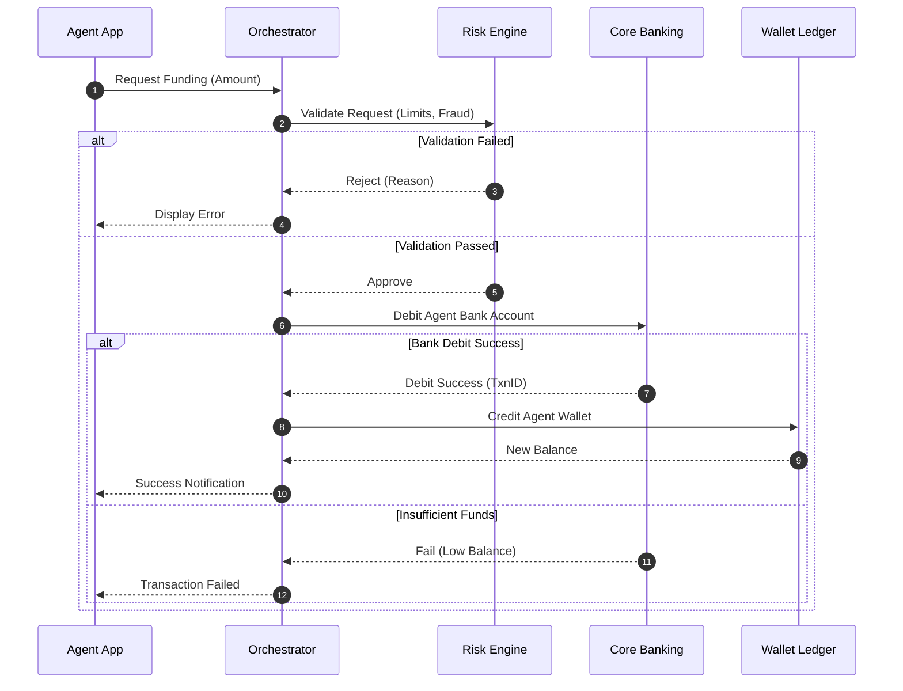
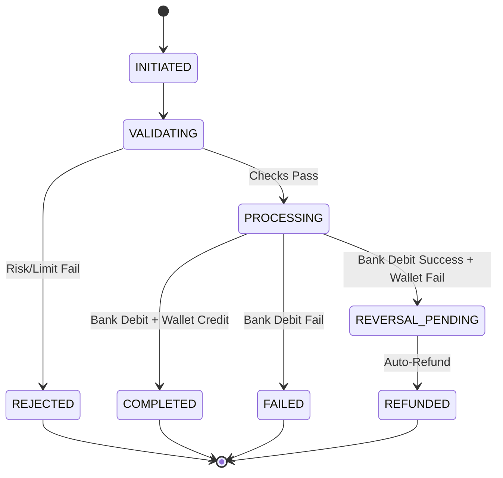

# Process Workflows

## 1. End-to-End Funding Flow

This diagram describes the happy path for an agent funding their wallet.

```mermaid
sequenceDiagram
    autonumber
    participant Agent App
    participant Orchestrator
    participant Risk Engine
    participant Core Banking
    participant Wallet Ledger

    Agent App->>Orchestrator: Request Funding (Amount)
    Orchestrator->>Risk Engine: Validate Request (Limits, Fraud)
    
    alt Validation Failed
        Risk Engine-->>Orchestrator: Reject (Reason)
        Orchestrator-->>Agent App: Display Error
    else Validation Passed
        Risk Engine-->>Orchestrator: Approve
        Orchestrator->>Core Banking: Debit Agent Bank Account
        
        alt Bank Debit Success
            Core Banking-->>Orchestrator: Debit Success (TxnID)
            Orchestrator->>Wallet Ledger: Credit Agent Wallet
            Wallet Ledger-->>Orchestrator: New Balance
            Orchestrator-->>Agent App: Success Notification
        else Insufficient Funds
            Core Banking-->>Orchestrator: Fail (Low Balance)
            Orchestrator-->>Agent App: Transaction Failed
        end
    end
```

## 2. State Transition Diagram

The lifecycle of a funding request.

```mermaid
stateDiagram-v2
    [*] --> INITIATED
    INITIATED --> VALIDATING
    VALIDATING --> REJECTED: Risk/Limit Fail
    VALIDATING --> PROCESSING: Checks Pass
    PROCESSING --> COMPLETED: Bank Debit + Wallet Credit
    PROCESSING --> FAILED: Bank Debit Fail
    PROCESSING --> REVERSAL_PENDING: Bank Debit Success + Wallet Fail
    REVERSAL_PENDING --> REFUNDED: Auto-Refund
    COMPLETED --> [*]
    FAILED --> [*]
    REJECTED --> [*]
    REFUNDED --> [*]
```
